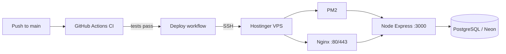

# Deploy KikooAI Backend to Hostinger VPS

Automated pipeline: **GitHub Actions** runs tests on every push/PR, then deploys to your VPS when `main` passes CI.

## Architecture



## 1. One-time VPS setup

SSH into the server (Hostinger panel → Browser terminal, or your SSH client):

```bash
ssh root@YOUR_VPS_IP
```

Run the bootstrap script (installs Node 20, PM2, Nginx, clones the app):

```bash
export APP_DIR=/opt/kikooai-backend
curl -fsSL https://raw.githubusercontent.com/Zyntrix-company/Kikooai-backend/main/deploy/setup-server.sh -o /tmp/setup-server.sh
bash /tmp/setup-server.sh
```

**Private repo:** clone manually with a deploy key or PAT:

```bash
git clone git@github.com:Zyntrix-company/Kikooai-backend.git /opt/kikooai-backend
cd /opt/kikooai-backend && bash deploy/setup-server.sh
```

### Configure production `.env`

On the VPS:

```bash
nano /opt/kikooai-backend/.env
```

Set at minimum: `DATABASE_URL`, `JWT_SECRET`, `JWT_EXPIRY`, `REFRESH_TOKEN_EXPIRY`, Cloudinary vars, `GEMINI_API_KEY`, `GOOGLE_CLIENT_ID`, `NODE_ENV=production`, `PORT=3000`.

Then:

```bash
cd /opt/kikooai-backend
npm run migrate
pm2 reload ecosystem.config.cjs --env production
curl -s http://127.0.0.1:3000/healthz | jq .
```

**Current production URL (HTTPS, no custom domain):**

| | URL |
|---|---|
| API base | `https://72-61-251-132.sslip.io/api/v1` |
| Health | `https://72-61-251-132.sslip.io/healthz` |

Uses [sslip.io](https://sslip.io): `72-61-251-132.sslip.io` resolves to `72.61.251.132`. Let's Encrypt certificate auto-renews.

> **Note:** `https://72.61.251.132` (raw IP) will show a certificate warning — always use the `sslip.io` hostname.

App runs on `PORT=3001` behind Nginx (port 3000 is used by another app on this VPS).

### HTTPS setup (already done on VPS)

To reproduce on a fresh server:

```bash
bash deploy/setup-https.sh
```

When you buy a domain later, point DNS A-record to the VPS IP and run:

```bash
certbot certonly --nginx -d api.yourdomain.com
# then update nginx server_name and APP_BASE_URL
```

## 2. GitHub repository secrets

In **GitHub → Zyntrix-company/Kikooai-backend → Settings → Secrets and variables → Actions**, add:

| Secret | Example | Required |
|--------|---------|----------|
| `VPS_HOST` | `72.61.251.132` | Yes |
| `VPS_USER` | `root` | Yes |
| `VPS_SSH_KEY` | Private key (PEM) for deploy | Yes* |
| `VPS_PASSWORD` | Root password | Only if not using SSH key |
| `VPS_PORT` | `22` | No (default 22) |
| `VPS_APP_DIR` | `/opt/kikooai-backend` | No |
| `VPS_DEPLOY_BRANCH` | `main` | No |

\*Prefer **SSH key** over password. Generate on your machine:

```bash
ssh-keygen -t ed25519 -C "github-deploy-kikooai" -f ~/.ssh/kikooai_deploy -N ""
```

Add the **public** key to the VPS:

```bash
mkdir -p ~/.ssh && chmod 700 ~/.ssh
echo "PASTE_PUBLIC_KEY_HERE" >> ~/.ssh/authorized_keys
chmod 600 ~/.ssh/authorized_keys
```

Put the **private** key contents into GitHub secret `VPS_SSH_KEY`.

## 3. CI/CD behavior

| Workflow | Trigger | What it does |
|----------|---------|--------------|
| `ci.yml` | Push/PR to `main` | Postgres service, migrate, seed users, `npm test` |
| `deploy.yml` | CI success on `main`, or manual **Run workflow** | SSH → `git pull`, `npm ci`, migrate, `pm2 reload` |

Manual deploy: **Actions → Deploy to Hostinger VPS → Run workflow**.

## 4. Security notes

- Never commit `.env` or passwords to git.
- Rotate any password that was shared in chat or tickets.
- Use a dedicated deploy user instead of `root` when possible.
- Enable HTTPS with Let's Encrypt: `certbot --nginx -d api.yourdomain.com`.

## 5. Troubleshooting

| Issue | Fix |
|-------|-----|
| Deploy SSH fails | Verify `VPS_SSH_KEY` or `VPS_PASSWORD`, firewall allows port 22 |
| `healthz` degraded | Check `.env` on VPS; ensure Neon/Postgres reachable from VPS IP |
| PM2 not running | `pm2 logs kikooai-backend`, `pm2 status` |
| Nginx 502 | App not listening: `pm2 restart ecosystem.config.cjs --env production` |
